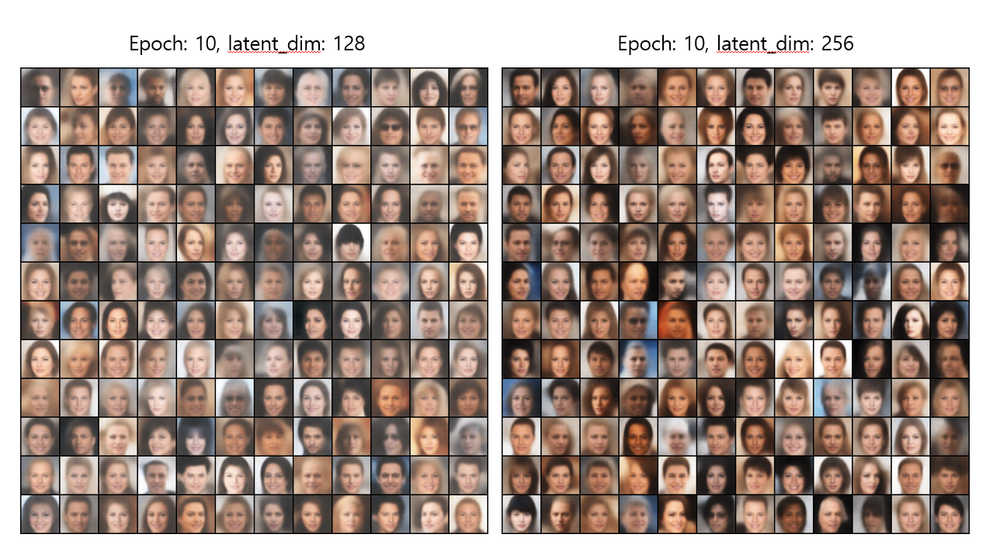

<h1 align="center">
  <b>PyTorch VAE</b><br>
</h1>



## 개요
- 원본 레포지토리:https://github.com/AntixK/PyTorch-VAE/tree/master
- lightning 최신 버전(2.4.0)에 맞게 코드 변경

### Requirements
- Python >= 3.10
- cuda 버전에 맞는 pytorch 설치
- Pytorch Lightning = 2.4.0 ([GitHub Repo](https://github.com/PyTorchLightning/pytorch-lightning/tree/deb1581e26b7547baf876b7a94361e60bb200d32))
- CUDA enabled computing device

### Installation
```
$ git clone https://github.com/jjlee6496/VAE
$ cd VAE
$ pip install -r requirements.txt
```

### Usage
```
$ cd PyTorch-VAE
$ python run.py -c configs/<config-file-name.yaml>
```
**Config file template**

```yaml
model_params:
  name: "<name of VAE model>"
  in_channels: 3
  latent_dim: 
    .         # Other parameters required by the model
    .
    .

data_params:
  data_path: "<path to the celebA dataset>"
  train_batch_size: 64 # Better to have a square number
  val_batch_size:  64
  patch_size: 64  # Models are designed to work for this size
  num_workers: 4
  
exp_params:
  manual_seed: 1265
  LR: 0.005
  weight_decay:
    .         # Other arguments required for training, like scheduler etc.
    .
    .

trainer_params:
  accelerator: 'gpu'
  devices: [0] 
  max_epochs: 100
  gradient_clip_val: 1.5
    .
    .
    .

logging_params:
  save_dir: "logs/"
  name: "<experiment name>"
```

**View TensorBoard Logs**
```
$ tensorboard --logdir ./<experiment name>/version_<the version you want>
```

**Note:** The default dataset is CelebA. However, there has been many issues with downloading the dataset from google drive (owing to some file structure changes). So, the recommendation is to download the [file](https://drive.google.com/file/d/1m8-EBPgi5MRubrm6iQjafK2QMHDBMSfJ/view?usp=sharing) from google drive directly and extract to the path of your choice. The default path assumed in the config files is `Data/celeba/img_align_celeba'. But you can change it acording to your preference.
